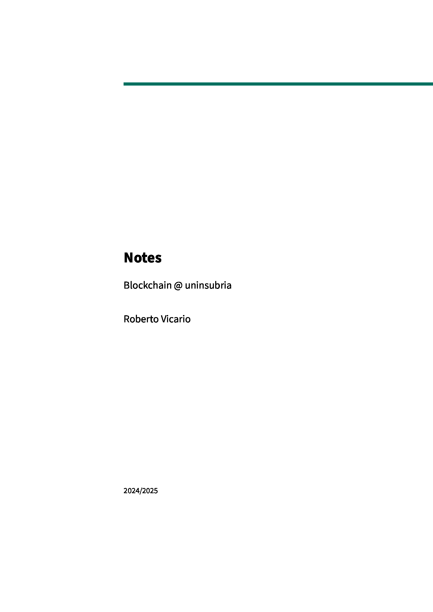

|  |
| - |

# Blockchain, MSc Course @ uninsubria

This repository contains my personal notes for the **Blockchain** course at the _University of Insubria_, part of the _MSc in Computer Science_.

## Overview

You can easily download my personal notes below, or simply browse them online on [Akademos](https://www.robertovicario.com/Akademos/docs/category/blockchain), my personal learning platform.

## Notes

Feel free to download my personal notes of the course by clicking the link below:

|  |
| - |

## Akademos

> **Sponsor**

|  |
| :-: |
| **Home - Akademos** |

## License

This project is distributed under [GNU General Public License version 3](https://opensource.org/license/gpl-3-0). You can find the complete text of the license in the project repository.
